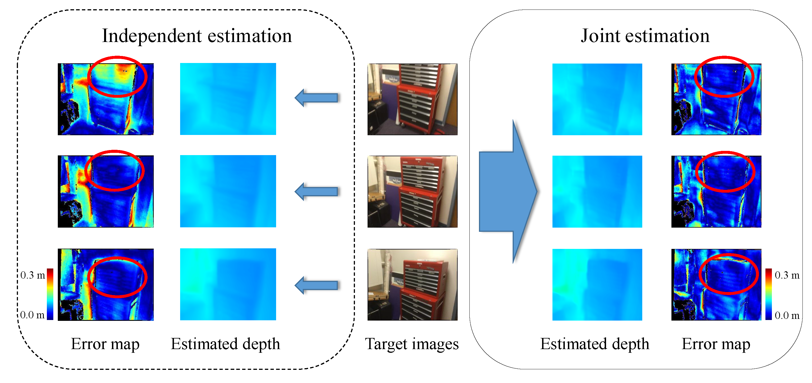

# ESTDepth: Multi-view Depth Estimation using Epipolar Spatio-Temporal Networks (CVPR 2021)

### [Project Page](https://www.xxlong.site/ESTDepth/) | [Video]() | [Paper](https://arxiv.org/pdf/2011.13118) | [Data](#dataset)



We present a novel method for multi-view depth estimation from a single video, which is a critical task in various applications, such as perception, reconstruction and robot navigation. 
Although previous learning-based methods have demonstrated compelling results, most works estimate depth maps of individual video frames independently, without taking into consideration the strong geometric and temporal coherence among the frames. 
Moreover, current state-of-the-art (SOTA) models mostly adopt a fully 3D convolution network for cost regularization and therefore require high computational cost, thus limiting their deployment in real-world applications. 
Our method achieves temporally coherent depth estimation results by using a novel Epipolar Spatio-Temporal (EST) transformer to explicitly associate geometric and temporal correlation with multiple estimated depth maps. 
Furthermore, to reduce the computational cost, inspired by recent Mixture-of-Experts models, we design a compact hybrid network consisting of a 2D context-aware network and a 3D matching network which learn 2D context information and 3D disparity cues separately. 

Here is the official repo for the paper:

* [Multi-view Depth Estimation using Epipolar Spatio-Temporal Networks (Long et al., 2021, <span style="color:red">CVPR 2021</span>)](https://arxiv.org/pdf/2011.13118).


## Table of contents
-----
  * [Installation](#requirements-and-installation)
  * [Dataset](#dataset)
  * [Usage](#train-a-new-model)
    + [Training](#train-a-new-model)
    + [Evaluation](#evaluation)
  * [License](#license)
  * [Citation](#citation)
------

## Requirements and Installation

This code is implemented in PyTorch.

The code has been tested on the following system:

* Python 3.6
* PyTorch 1.2.0
* [Nvidia apex library](https://github.com/NVIDIA/apex) (optional)
* Nvidia GPU (GTX 2080Ti) CUDA 10.1


To install, first clone this repo and install all dependencies:

```bash
conda env create -f environment.yml
```

Option: install apex to enable synchronized batch normalization 
```
git clone https://github.com/NVIDIA/apex.git
cd apex
pip install -v --no-cache-dir --global-option="--cpp_ext" --global-option="--cuda_ext" ./
```

## Dataset
Please also cite the original papers if you use any of them in your work.

Dataset | Notes on Dataset Split
---|---
[ScanNet](http://www.scan-net.org/) | see ./data/scannet_split/
[7scenes](https://www.microsoft.com/en-us/research/project/rgb-d-dataset-7-scenes/) | see ./data/7scenes/test.txt

## Train a new model

In the training stage, our model takes a sequence of 5 frames as input, with a batch size of ``4`` sequences on ``4`` GPUs.
We use the following code to train a model:

```bash
python -m torch.distributed.launch --nproc_per_node=4 train_hybrid.py  --using_apex  --sync_bn \
--datapath /userhome/35/xxlong/dataset/scannet_whole/  \
--testdatapath /userhome/35/xxlong/dataset/scannet_test/ \
--reloadscan True \
--batch_size 1 --seq_len 5 --mode train --summary_freq 10 \
--epochs 7 --lr 0.00004 --lrepochs 2,4,6,8:2 \
--logdir ./logs/hybrid_res50_ndepths64 \
--resnet 50 --ndepths 64 --IF_EST_transformer False \
--depth_min 0.1 --depth_max 10. |  tee -a ./logs/hybrid_res50_ndepths64/log.txt

```

```bash
bash train_hybrid.sh
```

## Evaluation

Once the model is trained, the following command is used to evaluate test images given the [trained_model](https://drive.google.com/file/d/12NGc7mqT97yTZY9ZLe2oEEhQRiSuQHp9/view?usp=sharing).

Our model has two testing modes: ``Joint`` and ``ESTM``

For ``Joint`` mode, run:

```bash
bash eval_hybrid.sh
```

For ``ESTM`` mode, run:

```bash
bash eval_hybrid_seq.sh
```

## License

ESTDepth is MIT-licensed.
The license applies to the pre-trained models as well.

## Citation

Please cite as 
```bibtex
@article{long2021multi,
  title={Multi-view Depth Estimation using Epipolar Spatio-Temporal Network},
  author={Long, Xiaoxiao and Liu, Lingjie and Li, Wei and Theobalt, Christian and Wang, Wenping},
  journal={CVPR},
  year={2021}
}
```